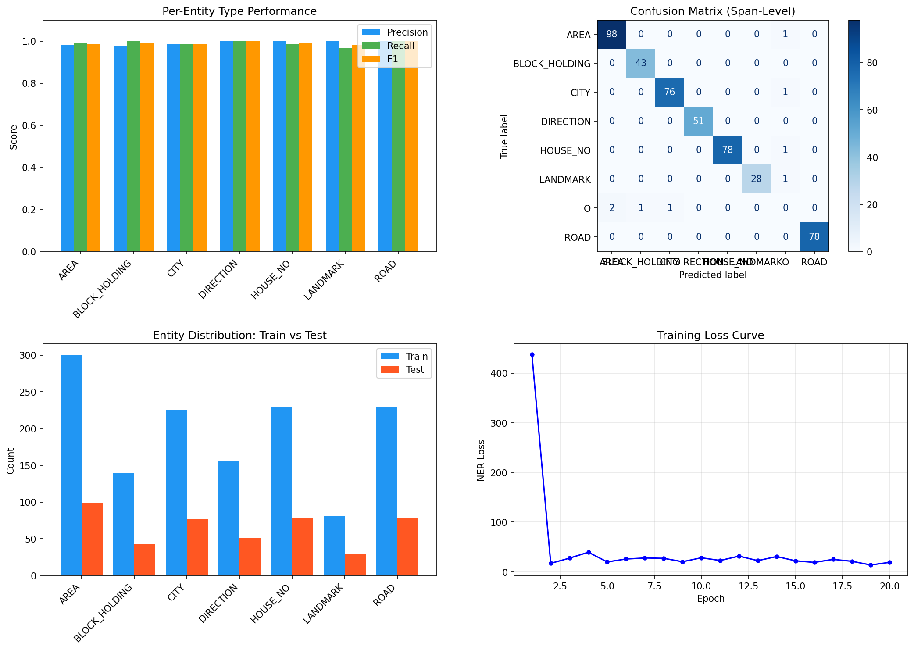
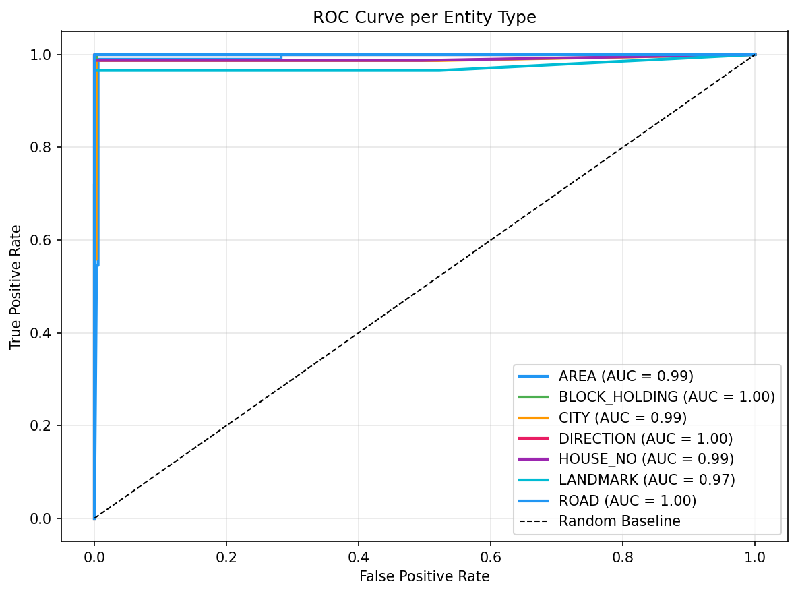

# Location Labeling Quality Measurement

[](https://www.python.org/)
[](https://spacy.io/)
[](https://labelstud.io/)
[](https://opensource.org/licenses/MIT)

A comprehensive project for annotating location data, training Named Entity Recognition (NER) models, and evaluating data quality through advanced metrics and visualizations. This repository demonstrates end-to-end location entity extraction from address text, focusing on assessing data cleanliness and model performance.

## 📋 Table of Contents

- [Features](#features)
- [Project Overview](#project-overview)
- [Installation](#installation)
- [Data Annotation](#data-annotation)
- [Model Training](#model-training)
- [Evaluation & Results](#evaluation--results)
- [Usage](#usage)
- [Project Structure](#project-structure)
- [Screenshots](#screenshots)
- [Contributing](#contributing)
- [License](#license)

## ✨ Features

- **Data Annotation**: Label location entities in address text using Label Studio
- **NER Model Training**: Train custom spaCy NER models for location entities
- **Quality Assessment**: Comprehensive evaluation with precision, recall, F1-score, and ROC curves
- **Data Cleanliness Analysis**: Assess annotation quality through model performance metrics
- **Visualization Suite**: Interactive charts including confusion matrices, entity distributions, and training loss curves
- **Entity Types**: Supports AREA, HOUSE_NO, ROAD, CITY, DIRECTION, LANDMARK, BLOCK_HOLDING
- **Interactive Demo**: Test the trained model on new addresses with color-coded entity highlighting

## 🎯 Project Overview

This project addresses the critical need for high-quality location data in applications ranging from logistics to geospatial analysis. By combining manual annotation with automated quality measurement, we provide a robust framework for:

1. **Annotating** raw address text with location entities
2. **Training** accurate NER models on labeled data
3. **Evaluating** both model performance and annotation quality
4. **Visualizing** results to identify data quality issues and improvement areas

The workflow ensures that location data is not only labeled but also validated for cleanliness, making it reliable for downstream applications.

## 🚀 Installation

### Prerequisites

- Python 3.8 or higher
- Label Studio (for data annotation)
- Git

### Setup

1. **Clone the repository:**
   ```bash
   git clone https://github.com/frhnsdk/location-labeling-quality-measurement.git
   cd location-labeling-quality-measurement
   ```

2. **Create a virtual environment:**
   ```bash
   python -m venv .venv
   .venv\Scripts\activate  # On Windows
   # source .venv/bin/activate  # On macOS/Linux
   ```

3. **Install dependencies:**
   ```bash
   pip install spacy scikit-learn matplotlib seaborn pandas jupyter
   python -m spacy download en_core_web_sm
   ```

4. **Install Label Studio (optional, for annotation):**
   ```bash
   pip install label-studio
   ```

## 📝 Data Annotation

We use Label Studio for professional data annotation of location entities in address text.

### Setting up Label Studio

1. **Start Label Studio:**
   ```bash
   label-studio start
   ```

2. **Create a new project:**
   - Go to http://localhost:8080
   - Create a new project for "Named Entity Recognition"
   - Upload your address text data

3. **Configure labeling interface:**
   - Define entity labels: AREA, HOUSE_NO, ROAD, CITY, DIRECTION, LANDMARK, BLOCK_HOLDING
   - Set up the annotation workflow

### Annotation Process

- **Input**: Raw address text (e.g., "123 Main St, Springfield, IL 62701")
- **Task**: Highlight and label location components
- **Output**: JSON export with annotated entities


## 🧠 Model Training

The project uses spaCy for training custom NER models on annotated location data.

### Training Process

1. **Data Preparation**: Convert Label Studio JSON to spaCy training format
2. **Model Architecture**: Blank English model with custom NER pipeline
3. **Training Configuration**:
   - Train/Validation/Test split (60/20/20)
   - 10-20 epochs with loss monitoring
   - GPU acceleration support

### Key Features

- **Entity Recognition**: Identifies 7 location entity types
- **Performance Monitoring**: Real-time loss tracking
- **Model Persistence**: Saves trained models for deployment

## 📊 Evaluation & Results

Comprehensive evaluation framework to assess both model performance and data quality.

### Metrics

- **Overall Performance**: Precision, Recall, F1-Score
- **Per-Entity Analysis**: Individual entity type performance
- **Span-Level Evaluation**: Token-level predictions with confusion matrix
- **ROC Analysis**: One-vs-rest ROC curves for multi-class evaluation

### Visualizations

- **Performance Charts**: Bar charts for precision, recall, F1 per entity
- **Confusion Matrix**: Span-level prediction accuracy
- **Entity Distribution**: Train vs test set balance analysis
- **Training Curves**: Loss progression over epochs
- **ROC Curves**: Multi-class ROC with AUC scores




### Data Cleanliness Assessment

The evaluation metrics serve as proxies for annotation quality:
- High F1 scores indicate clean, consistent labeling
- ROC curves help identify entity types needing more annotation
- Confusion matrices reveal common labeling errors

## 💻 Usage

### Running the Analysis

1. **Open the Jupyter notebook:**
   ```bash
   jupyter notebook data_processing.ipynb
   ```

2. **Follow the workflow:**
   - Load and preprocess Label Studio data
   - Train the NER model
   - Evaluate performance
   - Visualize results

### Testing the Model

Use the interactive demo in the notebook to test entity recognition on new addresses:

```python
from IPython.display import display, HTML
import spacy

# Load trained model
nlp = spacy.load("location_ner_model")

# Test on new address
address = "456 Oak Avenue, Downtown District, New York, NY 10001"
doc = nlp(address)

# Display results with color-coded entities
# (See notebook for full implementation)
```

### Model Output

The trained model provides:
- **Entity Spans**: Character positions of identified entities
- **Entity Labels**: Classification of location components
- **Confidence Scores**: Prediction confidence for each entity

## 📁 Project Structure

```
location-labeling-quality-measurement/
│
├── data_processing.ipynb              # Main analysis notebook
├── project-2-at-2026-02-07-01-16-16e367a4.json  # Label Studio export
├── location_ner_model/                # Trained spaCy model
│   ├── config.cfg
│   ├── meta.json
│   └── ner/
│       ├── cfg
│       ├── model
│       └── moves
│   └── vocab/
│       ├── key2row
│       ├── strings.json
│       ├── vectors
│       └── vectors.cfg
├── Label Studio Screenshots/          # Annotation interface screenshots
│   ├── Screenshot 2026-02-09 074100.png
│   ├── Screenshot 2026-02-09 074143.png
│   └── Screenshot 2026-02-09 074237.png
├── evaluation_charts.png              # Performance visualizations
├── roc_curves.png                     # ROC curve analysis
├── .gitignore                         # Git ignore rules
└── README.md                          # Project documentation
```

## 📸 Screenshots

### Label Studio Annotation Interface


### Entity Annotation Example


### Label Configuration


### Model Evaluation Results


### ROC Curve Analysis


## 🤝 Contributing

We welcome contributions to improve location data quality assessment!

1. Fork the repository
2. Create a feature branch (`git checkout -b feature/amazing-feature`)
3. Commit your changes (`git commit -m 'Add amazing feature'`)
4. Push to the branch (`git push origin feature/amazing-feature`)
5. Open a Pull Request

### Development Guidelines

- Add tests for new functionality
- Update documentation for API changes
- Ensure compatibility with Python 3.8+

## 📄 License

This project is licensed under the MIT License - see the [LICENSE](LICENSE) file for details.

## 🙏 Acknowledgments

- [spaCy](https://spacy.io/) for the excellent NLP framework
- [Label Studio](https://labelstud.io/) for professional annotation tools
- [scikit-learn](https://scikit-learn.org/) for evaluation metrics
- [Matplotlib](https://matplotlib.org/) and [Seaborn](https://seaborn.pydata.org/) for visualizations

## 📞 Contact

For questions or collaboration opportunities:
- **GitHub Issues**: [Create an issue](https://github.com/frhnsdk/location-labeling-quality-measurement/issues)
- **Email**: official.farhansadik@gmail.com

---

*Built with ❤️ for accurate location data processing and quality assurance.*